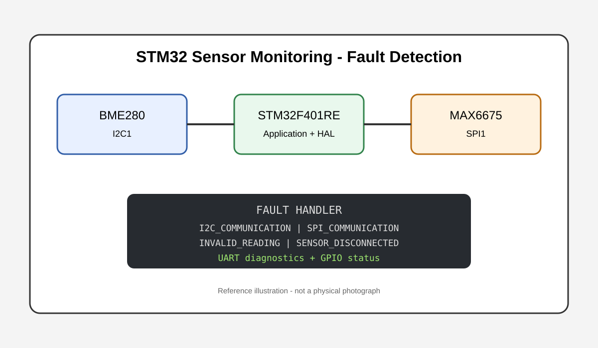
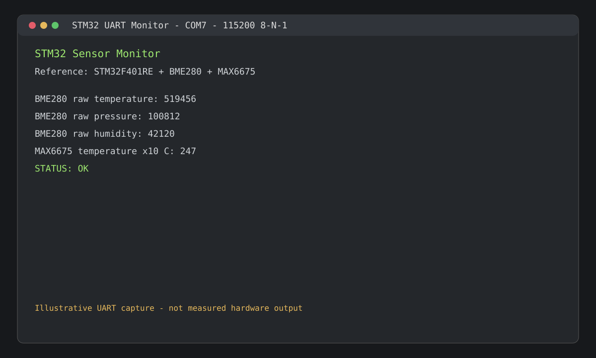

# STM32 Sensor Monitoring & Communication Firmware

)     

> **Reference implementation:** A structured STM32 Embedded C project demonstrating sensor acquisition, I2C/SPI communication, UART diagnostics, GPIO control, and fault handling.

## Project Overview

This project demonstrates how an STM32 firmware application can monitor multiple sensors through different communication interfaces and report system status through UART.

The reference design uses:
- **STM32F401RE** as the MCU
- **BME280** over I2C
- **MAX6675** over SPI
- **USART2** for diagnostics
- **GPIO** for status/fault indication
- A dedicated fault-detection layer

The code is organized to separate application logic, communication drivers, diagnostics, and fault handling.

## Reference Implementation Notice

This repository was created as a **reference firmware implementation** because the original STM32CubeIDE project and physical test hardware were not available.

Therefore:
- The MCU and peripheral configuration are explicitly documented.
- Sensor drivers are implemented against their documented communication interfaces.
- The `.ioc` file describes the intended STM32CubeMX configuration.
- UART values shown in documentation are illustrative.
- Test cases are documented as **Planned**, not falsely reported as completed hardware tests.

This distinction keeps the project technically honest while still demonstrating embedded firmware design and implementation skills.

## Key Features
- Embedded C firmware architecture
- STM32 HAL-based peripheral integration
- BME280 I2C driver
- MAX6675 SPI driver
- UART diagnostic logging
- GPIO status indication
- Communication fault detection
- Sensor-data validation
- Fault recovery flow
- STM32CubeMX `.ioc` configuration
- Hardware/pin documentation
- Structured firmware verification plan

## Hardware Configuration

| Component | Reference device | Interface | STM32 connection |
|---|---|---|---|
| MCU | STM32F401RE | ARM Cortex-M4 | Main controller |
| Environmental sensor | BME280 | I2C | PB8 / PB9 |
| Thermocouple interface | MAX6675 | SPI | PA5 / PA6 / PA7 |
| MAX6675 chip select | GPIO | Digital output | PB6 |
| Debug/diagnostic | USART2 | UART | PA2 / PA3 |
| Status output | GPIO | Digital output | PC13 |

### Communication settings
| Peripheral | Configuration |
|---|---|
| I2C1 | 100 kHz, 7-bit addressing |
| SPI1 | Master, 8-bit, software NSS, Mode 0 |
| USART2 | 115200 baud, 8-N-1 |
| Status GPIO | PC13 |
| MAX6675 CS | PB6 |

> Always verify the exact board pinout, breakout-board voltage requirements, pull-ups, and alternate-function mapping before connecting physical hardware.

## System Architecture

~~~text
                         STM32F401RE
                              |
              +---------------+---------------+
              |               |               |
             I2C             SPI             GPIO
              |               |               |
           BME280          MAX6675        Status LED
              |               |               |
              +-------+-------+               |
                      |                       |
                 Sensor Data                  |
                      |                       |
                      v                       |
                Fault Detection <-------------+
                      |
                      v
                 UART Logging
                      |
                      v
                Serial Terminal
~~~

## Firmware Flow

~~~text
+------------------+
| HAL / MCU Init   |
+--------+---------+
         |
         v
+------------------+
| Peripheral Init  |
| I2C / SPI / UART |
| GPIO             |
+--------+---------+
         |
         v
+------------------+
| Sensor Init      |
| BME280           |
+--------+---------+
         |
         v
+------------------+
| Read Sensors     |
| I2C + SPI        |
+--------+---------+
         |
         v
+------------------+
| Validate Data    |
+--------+---------+
         |
      +--+--+
      |     |
    Valid  Fault
      |     |
      v     v
   Report  Fault
    Data   Handler
      |     |
      +--+--+
         |
         v
   Wait / Repeat
~~~

## I2C Sensor Driver

The BME280 driver demonstrates device identification, sensor configuration, register-based acquisition, HAL transaction checking, and communication-failure propagation.

Source: `Core/Src/bme280.c`

## SPI Sensor Driver

The MAX6675 driver demonstrates software chip-select control, SPI frame acquisition, open-thermocouple detection, temperature conversion, and SPI failure reporting.

Source: `Core/Src/max6675.c`

## UART Diagnostics

USART2 is configured for **115200 baud, 8 data bits, no parity, 1 stop bit**.

Example format:

~~~text
STM32 Sensor Monitor
Reference: STM32F401RE + BME280 + MAX6675
BME280: OK

BME280 raw temperature: <value>
BME280 raw pressure: <value>
BME280 raw humidity: <value>
MAX6675 temperature x10 C: <value>
STATUS: OK
~~~

Fault example:

~~~text
FAULT: I2C_COMMUNICATION
~~~

The numeric values are placeholders for an actual hardware capture and should not be interpreted as measured results.

## Fault Detection

| Fault | Meaning |
|---|---|
| `I2C_COMMUNICATION` | I2C transaction failed |
| `SPI_COMMUNICATION` | SPI transaction failed |
| `SENSOR_DISCONNECTED` | Sensor/device is unavailable |
| `INVALID_READING` | Received data failed validation |
| `NONE` | No detected fault |

When a fault is detected, the firmware identifies the fault, reports it through UART, drives the configured status output, and continues the monitoring loop where possible.

## Project Structure

~~~text
stm32-sensor-monitoring-firmware/
|
+-- Core/
|   +-- Inc/
|   |   +-- app_config.h
|   |   +-- bme280.h
|   |   +-- fault_detection.h
|   |   +-- main.h
|   |   +-- max6675.h
|   |   +-- uart.h
|   |
|   +-- Src/
|       +-- bme280.c
|       +-- fault_detection.c
|       +-- main.c
|       +-- max6675.c
|       +-- stm32f4xx_hal_msp.c
|       +-- uart.c
|
+-- Drivers/
|   +-- I2C/
|   +-- SPI/
|
+-- Docs/
|   +-- hardware_setup.md
|   +-- system_architecture.md
|   +-- testing.md
|
+-- Images/
|   +-- fault_detection.svg
|   +-- uart_terminal.svg
|
+-- STM32_Sensor_Monitoring.ioc
+-- .gitignore
+-- LICENSE
+-- README.md
~~~

## Verification & Testing

The repository includes a structured test plan covering normal startup, BME280 I2C communication, I2C failure, MAX6675 SPI communication, SPI failure, open thermocouple detection, invalid sensor data, UART diagnostics, GPIO fault indication, and sensor recovery.

See **[Docs/testing.md](Docs/testing.md)** for the complete verification matrix and expected outputs.

### Current test status

**Planned / not physically verified**

No physical test results are claimed in this repository.

## STM32CubeIDE Setup

1. Open `STM32_Sensor_Monitoring.ioc` with STM32CubeIDE/STM32CubeMX.
2. Select the installed STM32Cube firmware package for STM32F4.
3. Regenerate standard startup/HAL project files if required by the installed CubeIDE version.
4. Add the files under `Core/` to the generated project.
5. Verify wiring against `Docs/hardware_setup.md`.
6. Build the project.
7. Flash the STM32 target.
8. Open a serial terminal at **115200 8-N-1**.
9. Execute the verification cases in `Docs/testing.md`.

> CubeIDE-generated startup and linker files can vary by firmware-package version and board configuration. Regenerating them from the `.ioc` is preferred over committing generated files from an unknown local environment.

## Skills Demonstrated

**Embedded:** Embedded C, STM32, ARM Cortex-M, STM32 HAL

**Interfaces:** I2C, SPI, UART, GPIO

**Firmware:** Driver development, sensor acquisition, fault handling, validation, diagnostics

**Tools:** STM32CubeIDE, STM32CubeMX, Git, GitHub

## Future Improvements
- Add full BME280 calibration compensation.
- Add configurable measurement thresholds.
- Add watchdog supervision.
- Add non-blocking communication using interrupts/DMA.
- Add unit tests for application-level fault logic.
- Add static analysis and formatting checks.
- Add real hardware test captures after physical validation.
- Add logic-analyzer traces for I2C and SPI transactions.

## Author

**Syed Sohel Khadri**

Embedded Firmware | STM32 | ARM Cortex-M | Embedded C

- GitHub: [sohailkhadri4-design](https://github.com/sohailkhadri4-design)
- LinkedIn: [Syed Sohel Khadri](https://www.linkedin.com/in/syed-sohel-khadri-7b570b381/)

## License

MIT License. See [LICENSE](LICENSE).